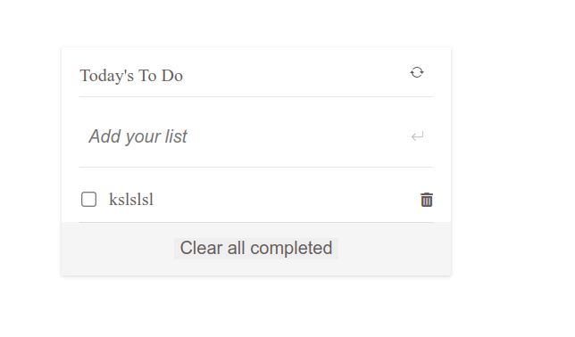

# work-with-webpack

"To-do list" is a tool that helps to organize your day. It simply lists the things that you need to do and allows you to mark them as complete. I will build a simple website that allows for doing that, and i will do it using ES6 and Webpack!

## Build with

HTML CSS Javascript, webpack

## Live Demo

[link to work with webpack](https://jenadiusnicholaus.github.io/To-Do-list/)

## Getting started

To get a local copy up and running follow these simple example steps.

``` xml
 git clone git+https://github.com/jenadiusnicholaus/work-with-webpack.git
 
```

## Requiremnts 

i needed to implement the following functionalities:

- Add a new item.
- Remove a selected item.
- Marke a selected item as complete.
- Remove all items marked as complete at once.
- Reorder a selected item (as drag-and-drop) [as an additional feature].

## Screenshot of the project



👤 **Author1**

- GitHub: *[@jenadiusnicholaus](https://github.com/jenadiusnicholaus/)*.
- Twiter: *[@jenadius_kaim](https://twitter.com/jenadius_kaim)*.
- LinkedIn: *[@Jenadius Nicholaus](https://www.linkedin.com/in/jenadius-nicholaus-73126819b/)*.

#### 🤝 Contributing

Contributions, issues, and feature requests are welcome!

Feel free to check the [issues page](../../issues/).

#### 📝 License

This project is [MIT](./MIT.md) licensed.
